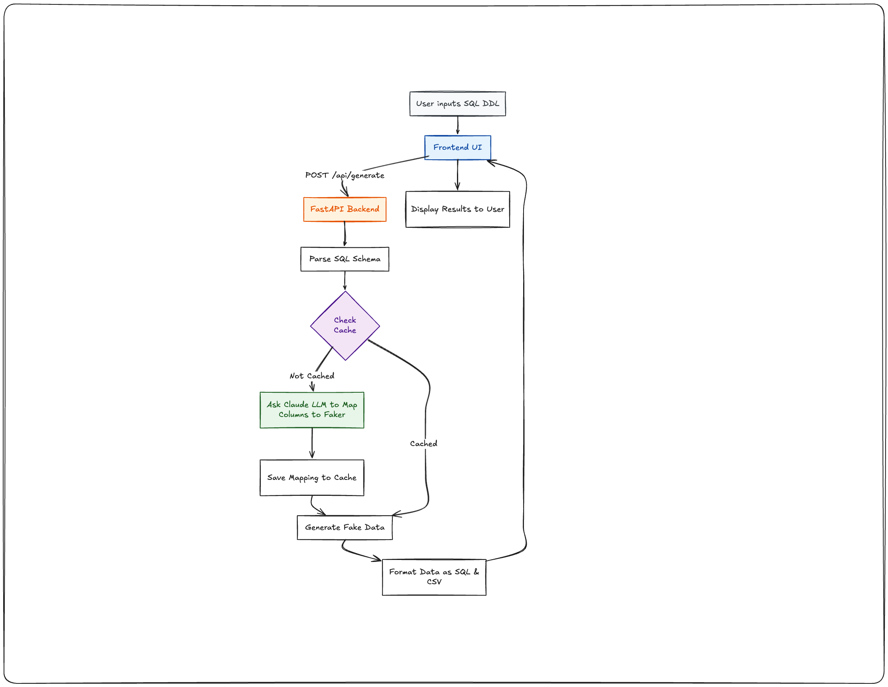

# Schema-Aware Test Data Generator
An intelligent, schema-aware test data generation tool that utilizes Large Language Models (LLMs) to create realistic, referentially consistent synthetic data based on SQL DDL definitions.


## Key Features

- **Schema Introspection & Parsing:** Automatically parses standard SQL DDL (Data Definition Language) to understand table structures, data types, and constraints.
- **Topological Sorting:** Resolves foreign key dependencies to ensure tables are populated in the correct relational order (e.g., creating `users` before `posts`).
- **LLM-Powered Data Mapping:** Uses Anthropic (Claude) to intelligently map database columns to appropriate semantic data generators (via Faker), ensuring contextually accurate test data (e.g., mapping `email_addr` to real-looking email addresses).
- **Multiple Export Formats:** Generates both combined `seed_all.sql` files and individual table `.csv` data dumps.

## Architecture



- **Backend:** Python 3, FastAPI, Click (for CLI)
- **Frontend:** Vanilla HTML5, CSS3, JavaScript
- **AI Integration:** Anthropic API (Claude)
- **Data Generation:** Python Faker

## Prerequisites

- Python 3.9 or higher
- A valid Anthropic API Key

## Installation

1. **Clone the repository:**
   ```bash
   git clone https://github.com/madhan-init/schema-aware-data-generator.git
   cd schema-aware-data-generator
   ```

2. **Set up a virtual environment:**
   ```bash
   python3 -m venv .venv
   source .venv/bin/activate  # On Windows use: .venv\Scripts\activate
   ```

3. **Install dependencies:**
   ```bash
   pip install -r requirements.txt
   ```

4. **Configure Environment Variables:**
   Create a `.env` file in the root directory and add your Anthropic API key:
   ```env
   ANTHROPIC_API_KEY=your_api_key_here
   ```

## Usage

### Running the Web Application

To launch the web interface, run the FastAPI server:

```bash
uvicorn backend.app:app --reload
```

Then, open your browser and navigate to `http://localhost:8000`. 
Paste your SQL DDL into the left pane, specify the number of rows, and click "Generate Data".

### Running the Command Line Interface (CLI)

You can generate data directly from the terminal without launching the web server.

```bash
python -m backend.main --ddl schemas/sample.sql --rows 50 --output ./output
```

**CLI Arguments:**
- `--ddl` (Required): Path to your SQL DDL file containing `CREATE TABLE` statements.
- `--rows` (Optional): Number of rows to generate per table. Default is 20 (Maximum 10,000 for safety).
- `--output` (Optional): Directory where the generated `.sql` and `.csv` files will be saved. Default is `./output`.

## Project Structure

```text
schema-aware-generator/
├── project/
│   ├── backend/
│   │   ├── parser/                # SQL DDL parsing
│   │   ├── mapper/                # LLM-to-Faker mapping
│   │   ├── generator/             # Data generation
│   │   └── exporter/              # File exports
│   ├── frontend/
│   │   └── assets/                # Static assets
│   ├── schemas/                   # Sample DDL files
│   └── output/                    # Generated test data
├── requirements.txt
├── README.md
├── .gitignore
└── .env
```
